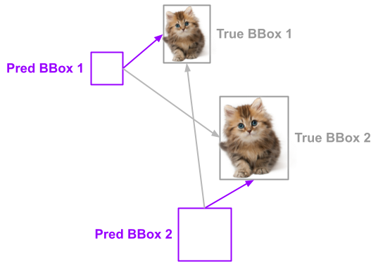

# Greedy Assignment Loss


[](https://github.com/mmgalushka/ga-loss/actions)
[](https://codecov.io/gh/mmgalushka/ga-loss)
[](https://www.codacy.com/gh/mmgalushka/ga-loss/dashboard?utm_source=github.com&amp;utm_medium=referral&amp;utm_content=mmgalushka/ga-loss&amp;utm_campaign=Badge_Grade)
[](https://github.com/psf/black)


[](https://github.com/mmgalushka/ga-loss/blob/main/LICENSE)

Computes the mean squared error between `y_true` and `y_pred` objects with prior assignment using the greedy algorithm.

## Installing

Install and update using [pip](https://pip.pypa.io/en/stable/quickstart/):

```bash
~$ pip install ga-loss
```

## How to use it?


## Where to use it?

Let's assume you are working on a deep learning model detecting multiple objects on an image. For simplicity of this example, let's consider, that our model intends to detect just two objects (see example below).



You have binding two true-bounding boxes for two images of kittens. Your model predicts pred-bounding boxes where it "thinks" the kittens are located. Now we need to compute the difference between true and predicted binding boxes to update model weights via back-propagation. But how to know which predicted box belongs to which true box? If we do not come up with the assignment algorithm which consistently assigned predicted boxes to the true boxes we will not be able to successfully train our model.

Here the loss function implemented in this project can help you. Intuitively you can see that predicted BBox 2 is close to the true BBox 1 and likewise predicted BBox 1 is close to the true BBox 2. the cost of assigning these pairs would be minimal compared to any other combinations. As you can see, this is a classical assignment problem. You can solve this problem using the Hungarian Algorithm. Its Python implementation can be found here. It is also used by DERT Facebook End-to-End Object Detection with Transformers model. However, if you wish to use pure tensor-based implementation this library is for you.

## How it works?

To give you more insights into this implementation we will review a hypothetical example. This example is also related to code embedded comments, so you easily navigate and modify the source code.

Let define true-bounding boxes for objects T1 and T2:

| Object | Bounding boxes |
|--------|----------------|
| T1     | 1., 2., 3., 4. |
| T2     | 5., 6., 7., 8. |

Do the same for the predicted boxes P1 and P2:

| Object | Bounding boxes |
|--------|----------------|
| P1     | 1., 1., 1., 1. |
| P2     | 2., 2., 2., 2. |

et's compute the Euclidean distances between all combinations of True and Predicted bounding boxes:

|    | P1        | P2       |
|----|-----------|----------|
| T1 | 3.7416575 | 2.449489 |
| T2 | 11.224972 | 9.273619 |

This algorithm will compute the assignment mask first:

|    | P1 | P2 |
|----|----|----|
| T1 | 0  | 1  |
| T2 | 1  | 0  |

And then compute the final error:

`loss = (2.449489 + 11.224972) / 2 = 6.8372305`

In contrast, if we would use the different assignment 6.50763825